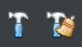

# Clase 2

## Comando para clonar repositorio:
```
    git clone <url del repositorio>
```
## Comandos de git para subir un cambio

1. Inicializar un repositorio en el directorio local:
```
    git init
```
2. Agregar los archivos modificados:
```
    git add .
```
3. Realizar un **commit** de los cambios:
```
    git commit -m "Mensaje de commit"
```
4. Subir los cambios al repositorio remoto:
```
    git push -u origin main
```


## Comandos para descargar cambios:

1. Ingresar al reposiotrio
```
    cd <nombre del directorio
```

2. Descargar cambios:
```
    git pull origin main
```

---


## Crear ejecutable para Java Maven


1. Ubicarce en el archivo **pom.xml**:
    *Projecto > Project Files > pom.xml*

2. Ubicarse abajo de las etiqueta **<** **packaging** **>**

3. Copiar el siguiente bloque y cambiar en < mainClass > por el nombre de su proyecto y de su clase principal:
```
    <build>
        <plugins>
            <plugin>
                <!-- Build an executable JAR -->
                <groupId>org.apache.maven.plugins</groupId>
                <artifactId>maven-jar-plugin</artifactId>
                <version>3.2.2</version>
                <configuration>
                    <archive>
                        <manifest>
                            <addClasspath>true</addClasspath>
                            <classpathPrefix>lib/</classpathPrefix>
                            <mainClass>"Nombre del paquete"."Nombre de la clase"</mainClass>
                        </manifest>
                    </archive>
                </configuration>
            </plugin>
        </plugins>
    </build>
```
4. Darle al boton de Build en el IDE:

    

5. Abrir la consola y ubicarse en la direccion del ejecutable. 
```
    cd <direccion del ejecutable>
```

6. Ejecutar el siguiente comando:
```
    java -jar "Nombre del ejecutable".jar
```

### Videos para auxiliase

* Generar Jar Ejecutable con Maven y Java: https://youtu.be/j7dkW_edT18


